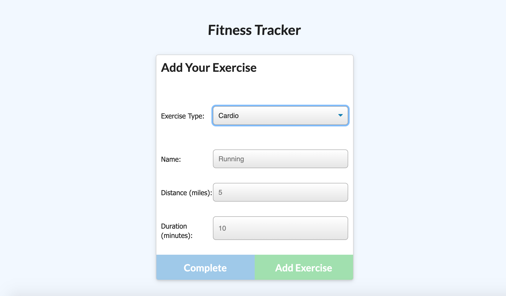
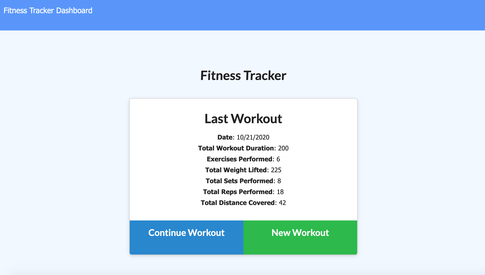
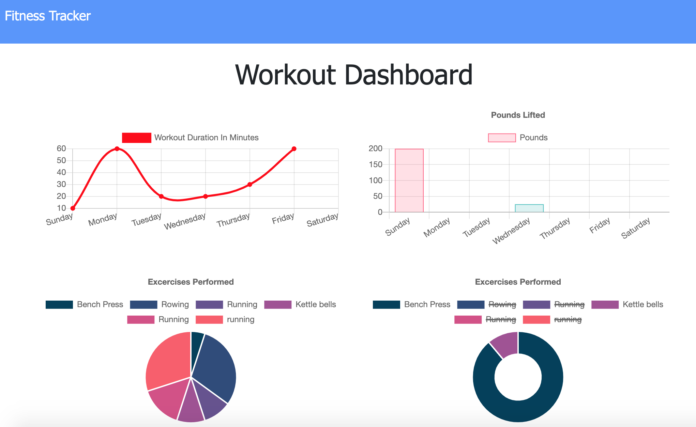

# Workout Tracker | UNC Coding Bootcamp 

  ## Description
  A workout tracker.

  

  

  

  ## Installation
  This app is deployed on Heroku, no need to install! 
  Here is the link: 

  [Workout Tracker](https://infinite-ridge-09131.herokuapp.com/) 
  
  

  ## Built With
  node.js
  mongoDB
  mongoose
   

  ## License

  MIT

  ## Contributing

   GitHub: [chelSEA-88](https://github.com/ChelSEA-88)
   

  ## Questions
   GitHub: [chelSEA-88](https://github.com/ChelSEA-88)
   
  [Email: chelsea.haviland13@gmail.com](chelsea.haviland13@gmail.com)
  Contact me! Email me or message me on LinkedIn!
